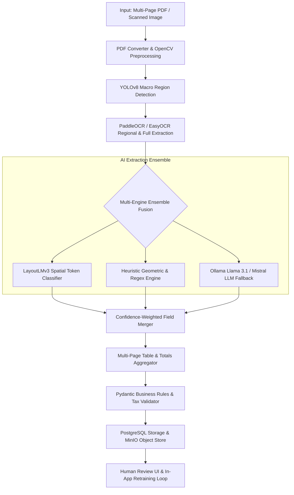

# AI Invoice Digitizer — Intelligent Multi-Page Extraction Pipeline

A production-grade, 100% free & open-source hybrid AI pipeline that converts multi-page invoice PDFs and scanned images into structured, canonicalized digital records. Runs fully offline with zero API costs.

---

## 🏗️ Architecture Overview



---

## ✨ Key Capabilities & Recent Enhancements

### 1. 📄 Multi-Page PDF Extraction
* Iterates through **all pages** of multi-page invoices.
* Performs YOLO macro region detection and OCR across all pages.
* Automatically merges multi-page item tables and extracts grand totals, taxes, and bank details located on later pages.

### 2. 🛡️ Multi-Engine Ensemble Fusion (`_merge_invoices`)
* Combines **LayoutLMv3** (spatial transformer) + **PaddleOCR** + **Deterministic Heuristic Regex** + **Local LLM Fallback (Ollama)**.
* **Confidence-Weighted Winner Selection**: Prioritizes the highest-confidence extraction for every individual field to eliminate blank/null values.
* Subword BPE alignment (`encoding.word_ids(0)`) prevents token desynchronization.

### 3. 🖥️ Modern React Review UI (Split-View & Wizard)
* **Guided Wizard & Standard Form Modes**: Fast verification and step-by-step review.
* **High-Precision Document Viewer**: Smooth bidirectional panning and zoom (40% to 350%) without cropping or overflow issues.
* **Live Document Paging**: Multi-page selector for original PDFs and rendered HTML previews.
* **One-Click Export**: Copy JSON for form integration (`invoiceForm.patchValue`) and instant PDF downloads.

### 4. 🔁 Continuous Learning & Model Retraining Loop
* **LayoutLMv3 Fine-Tuning**: Automatically exports verified invoice corrections into BIO token datasets to improve field accuracy toward **90%+**.
* **YOLOv8 Region Retraining**: Retrains visual bounding boxes on newly introduced invoice layouts.

---

## 🧰 Tech Stack

| Layer | Technology | License |
|---|---|---|
| **API Backend** | FastAPI + Uvicorn (Python 3.12 / 3.13) | MIT |
| **Task Queue** | Celery + Redis | BSD |
| **Image Preprocessing** | OpenCV + Pillow | BSD / HPND |
| **PDF Rasterization** | PyMuPDF (`pymupdf`) | AGPL |
| **Macro Region Detection** | YOLOv8 (`ultralytics`) | AGPL |
| **OCR Engine** | PaddleOCR v3 / PaddleX + EasyOCR Fallback | Apache 2.0 |
| **Spatial Layout AI** | LayoutLMv3 (`transformers`, HuggingFace) | MIT |
| **LLM Fallback** | Ollama (Llama 3.1 / Mistral) | MIT |
| **Data Validation** | Pydantic v2 | MIT |
| **Database** | PostgreSQL (SQLAlchemy ORM) | PostgreSQL |
| **Object Storage** | MinIO | AGPL |
| **Frontend UI** | React + Vite + Tailwind CSS + Lucide Icons | MIT |

---

## 🚀 Quick Start

### 1. Prerequisites

- Python 3.12+ (or Python 3.13 / 3.14)
- Node.js 18+ & npm
- Redis Server (for background tasks)
- PostgreSQL Server
- Ollama (Optional, for zero-shot LLM fallback) — [https://ollama.com](https://ollama.com)

### 2. Ollama Setup (Optional Fallback)

```bash
# Pull model for local extraction fallback
ollama pull llama3.1
# or
ollama pull mistral
```

### 3. Python Environment Setup

```bash
# Clone or navigate to the directory
cd ai-invoice

# Create virtual environment
python -m venv venv

# Activate virtual environment
# Windows:
venv\Scripts\activate
# Linux/macOS:
source venv/bin/activate

# Install dependencies
pip install -r requirements.txt
```

### 4. Environment Configuration

```bash
cp .env.example .env
# Edit .env to set your DB credentials, Redis URL, and MinIO endpoints
```

### 5. Launch Services

#### Terminal 1: FastAPI Server
```bash
uvicorn api.main:app --reload --port 8000
```

#### Terminal 2: Celery Worker
```bash
# Windows:
celery -A worker.celery_app worker --loglevel=info --pool=solo

# Linux/macOS:
celery -A worker.celery_app worker --loglevel=info
```

#### Terminal 3: React Review UI
```bash
cd review_ui
npm install
npm run dev
```

### 6. Access Web Interfaces

* **Review UI**: [http://localhost:5173](http://localhost:5173)
* **Interactive API Documentation (Swagger)**: [http://localhost:8000/docs](http://localhost:8000/docs)
* **ReDoc API Documentation**: [http://localhost:8000/redoc](http://localhost:8000/redoc)

---

## 🎯 Model Training & Fine-Tuning Guide

### When to Train Which Model?

| Model | What it Learns | Recommended Frequency |
|---|---|---|
| **LayoutLMv3** *(Entity Classifier)* | Learns specific field names, numbers, GSTINs, totals, and line item tokens from your reviewed field corrections. | **Regularly** (Every 5–15 reviewed invoices) |
| **YOLOv8** *(Region Detector)* | Learns visual boundary rectangles for Header, Vendor block, Items table, Totals, and Bank details. | **Occasionally** (Every 30–50 invoices) |

### 1. In-App Retraining (Recommended)
1. Open the Review UI at [http://localhost:5173](http://localhost:5173).
2. Click **Train Models** in the top navigation bar.
3. Click **Fine-tune LayoutLMv3** or **Retrain YOLOv8**.

### 2. Command-Line Training

#### Fine-Tune LayoutLMv3:
```bash
# 1. Export reviewed invoices from database to LayoutLM BIO format
python scripts/export_reviewed_to_layoutlm.py --output-dir data/processed/layoutlm_dataset

# 2. Run fine-tuning
python scripts/train_layoutlm.py --data-dir data/processed/layoutlm_dataset --epochs 10 --output-dir data/models/layoutlmv3-finetuned
```

#### Retrain YOLOv8:
```bash
python scripts/train_yolo.py --data data/annotations/dataset.yaml --epochs 60 --output data/models/invoice_yolo.pt
```

---

## 📁 Repository Structure

```
ai-invoice/
├── api/                          # FastAPI application & pipeline orchestrator
│   ├── main.py                   # REST endpoints, background tasks & model retraining
│   ├── pipeline_runner.py        # Multi-page extraction pipeline & ensemble runner
│   ├── models.py                 # Pydantic schemas & response models
│   └── dependencies.py           # Shared dependency injectors
├── preprocessing/                # OpenCV image processing & deskewing
│   ├── pipeline.py               # Grayscale, binarization, noise reduction, deskew
│   └── pdf_converter.py          # PyMuPDF rasterization & image conversion
├── detection/                    # YOLOv8 macro region detector
│   └── detector.py               # Header, vendor, buyer, items, totals bounding boxes
├── ocr/                          # Optical character recognition
│   └── extractor.py              # PaddleOCR wrapper with EasyOCR fallback
├── understanding/                # Spatial entity extraction
│   └── layoutlm.py               # LayoutLMv3 token classifier + Ensemble Merger
├── llm_fallback/                 # Local LLM batch entity extractor
│   └── ollama_client.py          # Ollama JSON fallback for low-confidence fields
├── validation/                   # Pydantic rules engine & format canonicalizer
│   └── validator.py              # GSTIN format, tax math, dates & item validation
├── worker/                       # Celery asynchronous task definitions
│   └── tasks.py                  # Background job queue processing
├── output/                       # Output generators
│   └── renderer.py               # HTML template & WeasyPrint PDF renderer
├── storage/                      # Persistence layer
│   └── db.py                     # PostgreSQL models & SQLAlchemy async session
├── review_ui/                    # React + Vite Human-in-the-Loop Review UI
│   ├── src/pages/ReviewPage.jsx  # Split-view & Guided Wizard editor
│   ├── src/pages/InvoiceListPage.jsx # Invoices dashboard & upload manager
│   └── src/index.css             # Tailored styling & design system
├── scripts/                      # Training & migration CLI utilities
│   ├── export_reviewed_to_layoutlm.py # Ground-truth exporter for BIO tagging
│   ├── train_layoutlm.py         # LayoutLMv3 fine-tuning script
│   ├── train_yolo.py             # YOLOv8 bounding box training script
│   └── test_pipeline.py          # End-to-end extraction CLI tester
├── data/                         # Local models, annotations & datasets
│   ├── models/                   # Active YOLO (.pt) & LayoutLM model weights
│   └── raw/                      # Sample input documents
└── tests/                        # Pytest suite
```

---

## 📜 License

This project is licensed under the **MIT License**. All bundled and integrated dependencies (PaddleOCR, YOLOv8, LayoutLMv3, PyMuPDF, OpenCV, Ollama) are open-source and free for development and deployment.
